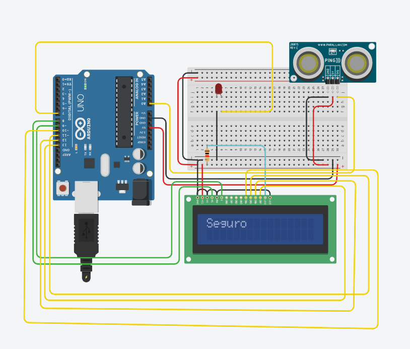
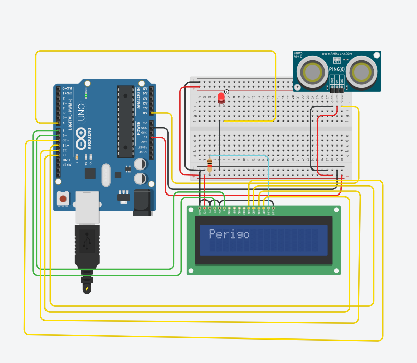
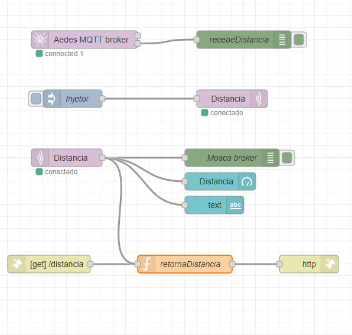
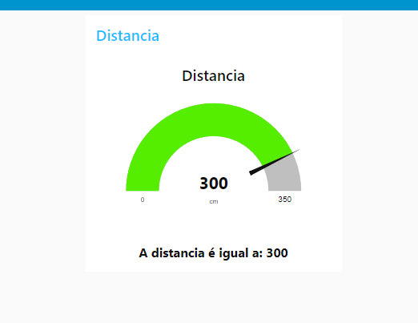

# BAZE
## Apresentação do projeto
Você vive uma rotina agitada, entre trabalho, estudos e responsabilidades do dia a dia. Encontrar tempo para se dedicar à sua saúde e bem-estar tornou-se um desafio constante, não é mesmo? É aí que a Baze entra em cena para mudar essa realidade.
Apresentamos uma solução inovadora que associa o uso da bicicleta ao incentivo do esporte e à melhoria da saúde, tudo isso na palma da sua mão. Nosso aplicativo foi cuidadosamente desenvolvido para simplificar a integração do ciclismo à sua rotina diária, proporcionando uma abordagem única para a promoção da atividade física e bem-estar.

## Recursos
Utilizando a tecnologia api do maps, oferecemos rotas específicas para ciclistas, levando em consideração a segurança e a beleza do percurso. Adeus, preocupações com trajetos inadequados.
Desafios semanais, conquistas e pontos de recompensa transformam cada pedalada em uma experiência motivadora. Descubra uma nova forma de se exercitar, aliviando o estresse e fortalecendo a saúde.

## Objetivo
O objetivo principal do Projeto é ajudar no bem-estar das pessoas e ao mesmo tempo incentivar a pratica de um esporte físico, com isso você contribui a melhora da sua qualidade de vida. 

## IOT
Tendo em vista a segurança do ciclista, desenvolvemos uma solução em IOT que visa mostrar objetos que estejam na distancia de 300cm da bike. A ideia é sinalizar para o ciclista que ele está se aproximando de algum objeto ou vice-versa.
Também decidimos mostrar para ele de 2 formas, com um visor ou com uma luz de led (facilitando ainda mais para o ciclista)
Desenvolvemos o projeto no TinkerCad, abaixo seguem as imagens do funcionamento do mesmo:

### Caso não tenha nenhum objeto no raio de 3 metros de distância:

### Caso tenha algum objeto no raio de 3 metros de distância:

## Flows
Também desenvolvemos nosso flow em node-red para integração com o Arduino. A ideia é receber a distância do arduino e mostrar isso em um dashboard que poderá ser mostrado no celular do ciclista.

Seguem as evidências do mesmo:

